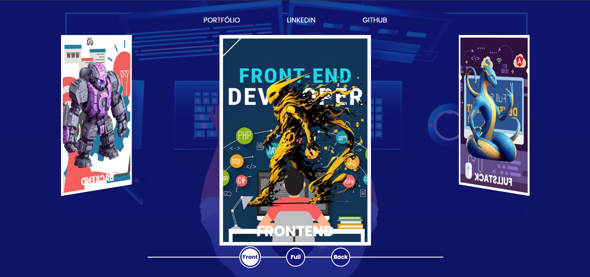

#  Projeto CodeVerse

## Inspirado no Spider-Man Multiverses - DIO

## Descrição

O **Spider-Man Multiverses** iniciou como um projeto inspirado no universo do Homem-Aranha, criado para apresentar um site interativo com temas relacionados ao herói. No entanto, após muito trabalho e dedicação, o tema foi completamente alterado para criar uma página educativa sobre **Desenvolvimento Backend**, **Desenvolvimento Frontend** e **Desenvolvimento FullStack**, surgindo assim o **CodeVerse**. As imagens, backgrounds, cores e alguns elementos do site original foram modificados para refletir o novo objetivo.

O site agora apresenta uma explicação clara e objetiva para os usuários sobre o que envolve cada uma dessas camadas de desenvolvimento de software, com links para aprender mais sobre as tecnologias e práticas envolvidas.

Além disso, o **menu superior** foi atualizado para direcionar os usuários ao meu **Portfólio**, **GitHub** e **LinkedIn**, para facilitar o acesso aos meus outros projetos e perfis profissionais.

## Funcionalidades

- **Explicações Educativas**: O site é dividido em três seções principais que explicam o que é o desenvolvimento **Frontend**, **Backend** e **FullStack**.
- **Interatividade**: O layout do site permite que o usuário navegue facilmente entre as seções.
- **Modificações Visuais**: Alterações significativas nas imagens, backgrounds e cores para refletir o novo tema, removendo elementos relacionados ao Homem-Aranha.
- **Menu Atualizado**: O menu foi modificado para incluir links para meu **Portfólio**, **GitHub** e **LinkedIn**.
- **Responsive Design**: O site foi feito para ser responsivo e funcionar bem tanto em desktops quanto em dispositivos móveis.

## Tecnologias Utilizadas

- HTML
- CSS
- JavaScript

## Contribuindo

Se você deseja contribuir para o projeto, fique à vontade para criar um Fork e enviar um Pull Request .

